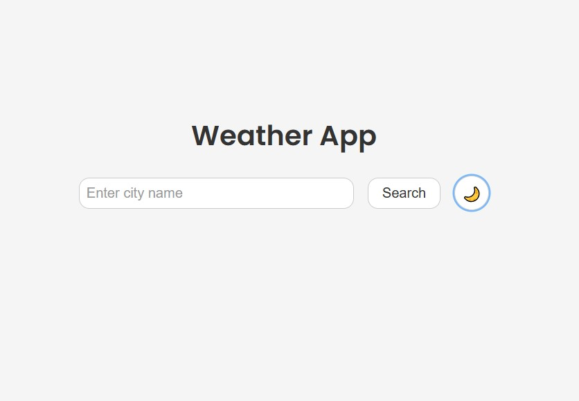
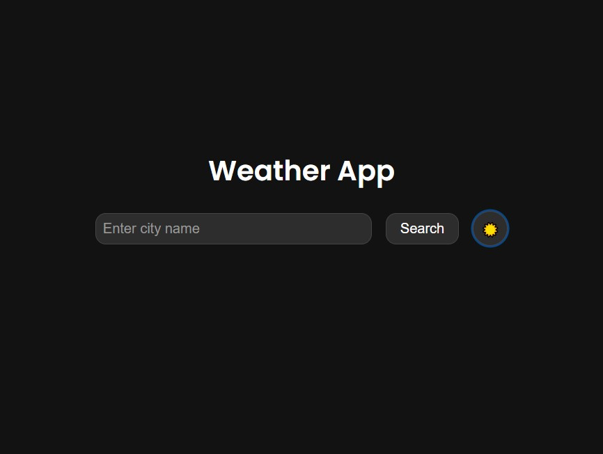

# WeatherFocusApp

A responsive weather application with dark/light mode and 5-day forecast.

## Image 1



## Image 2



## Features

- **Current Weather Data**:

  - Temperature (Fahrenheit)
  - Weather conditions
  - Humidity
  - Wind speed
  - Feels-like temperature

- **5-Day Forecast**:

  - Horizontal scrolling display
  - Daily temperature highs
  - Weather condition icons

- **User Experience**:
  - Dark/Light mode toggle
  - Dynamic weather-based theming
  - Responsive design for all devices
  - Location search functionality

## Technologies Used

- React.js
- Vite
- Axios for API calls
- OpenWeatherMap API
- CSS3 with modern flexbox layout

## Installation

1. Clone the repository:

```bash
git clone https://github.com/Kennedy01-crypto/WeatherFocusApp.git
```

2. Install dependencies:

```bash
npm install
```

3. Create a `.env` file in the root directory with your OpenWeatherMap API key:

```env
VITE_WEATHER_API_KEY=your_api_key_here
```

4. Run the development server:

```bash
npm run dev
```

## Deployment

The app is deployed using GitHub Pages:

```bash
npm run build && git add dist -f && git commit -m "Adding dist folder" && git subtree push --prefix dist origin gh-pages
```

## Live Demo

Access the live version at:  
https://weather-focus-app.vercel.app/

## Configuration

To customize the app:

- Update color schemes in `src/App.css`
- Modify API endpoints in `src/App.jsx`
- Adjust forecast days in the weather data processing function

## License

MIT License
